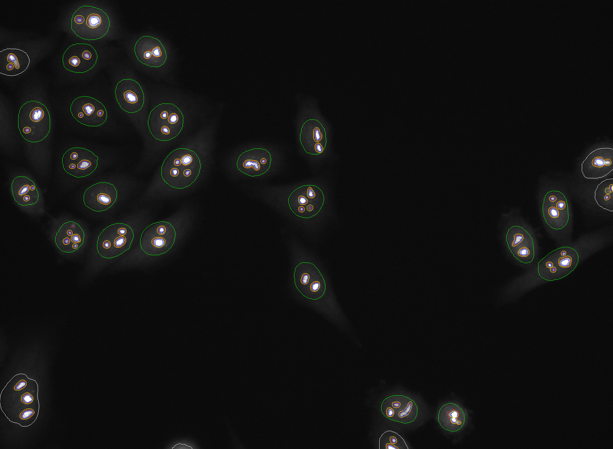

# nucleolus_seg_DHM

This code allows to quantify nucleoli in fluorescence and DHM images. Nucleoli and nuclei were segmented with a thresholding-based approach in GFP and DAPI images, respectively. Nucleoli and nuclei were segmented in DHM images using supervised learning. Since fluorescence and DHM images are aligned, the nuclei and nucleoli segmentation binary masks obtained for the fluorescence images were used as labels for the deep learning-based approach. Indeed, the manual generation of labels for the deep learning approach is not tractable. 

## Getting Started

### Prerequisites

The code runs with Python 3.6.10 , Keras 2.4.3 and Tensorflow 2.2.0.

### Uploading microscopy data

- 75 raw multimodal images should be placed in the 'raw' folder under the format 'plateX_AY_sZ_modality.TIF'. The following modalities should be provided 'dapi', 'gfp', 'holo' and 'phase'. For instance, 'plate1_A01_s1_dapi.TIF', 'plate1_A01_s1_gfp.TIF', plate1_A01_s1_holo.TIF' and 'plate1_A01_s1_phase.TIF' are a valid entry.

- For the validation, the manual contours of the nucleoli (drawn on the GFP images) should be provided for the 25 first images and placed in the 'manual_masks' folder.

## Running the code

### Segmentation on fluorescence images

Open and launch the 'pipeline_fluo.py' script. The script performs the following steps
- Loading and normalization of the raw data
- Nuclei segmentation on DAPI images 
- Nucleoli segmentation on GFP images: local maxima detection, region growing, holes filling, dilation

The segmentation results are automatically saved in the 'samples' folder under the following names: 'labels_nucleoli_RG_t015_v18_wo_holes_dilated2_shifted_0.npy' (for the nucleoli area), 'labels_nucleoli_RG_rt045_v18_wo_holes_shifted_0.npy' (for the nucleoli counting) and 'labels_dapi_close.npy' (for the nuclei).

### Segmentation on DHM images

Open and launch the 'run.py' script. This will train two models from nucleoli and nuclei segmentation in DHM images. The inference is automatically launched. The predictions and models can be found in the 'results' folder. The subfolders 'firstval0', 'firstval25', 'firstval50' provide results on the individual folds. The concatenated predictions are in the top folder.   

### Statistics computations

Launch the 'compute_statistics_dhm.py' script to obtained the statistics for the segmentation on DHM images. Launch the 'compute_statistics_fluo.py' script to obtained the statistics for the segmentation on fluorescence images. For the latter, run first the script with the 'run_manual = True' mode and then with the 'run_manual = False'. The statistics on the manual contours should be computed first in order to build the confusion matrix afterwards. Results are provided partly in the 'statistics' folder and in the terminal.

### Display the results

In order to obtain the figures shown in the paper, run the 'display' script. You should obtain images such as the following one. 

